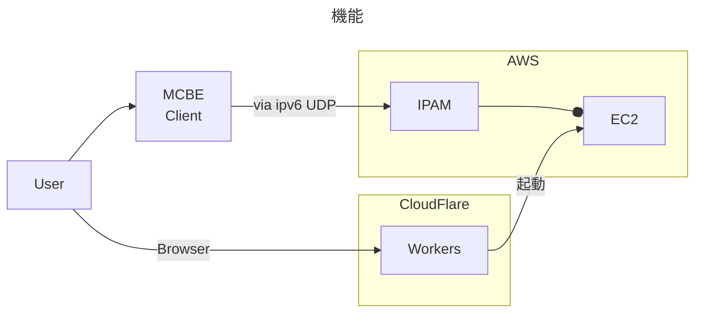

## インフラ構成図

```mermaid
architecture-beta

%% 定義
%% AWS
group aws(logos:aws)[AWS]
service lambda(logos:aws-lambda)[Lambda] in aws
service watch(logos:aws-cloudwatch)[CloudWatch] in aws

group region(material-symbols:flag-outline)[Region Asia Pasific North East 1] in aws
group vpc(logos:aws-vpc)[VPC] in region
group az[AZ a] in vpc
group subnet(material-symbols:lock-open-outline)[Public Subnet] in az
service ipam(logos:aws-vpc)[IPAM] in az
service ec2(logos:aws-ec2)[EC2] in subnet
service ebs(disk)[EBS] in subnet

%% CloudFlare
group cf(logos:cloudflare-icon)[CloudFlare]
service worker(logos:cloudflare-workers-icon)[Workers] in cf

junction cf2aws

%% 接続
lambda:R --> L:ec2
ec2:R -- L:ebs
lambda:T --> B:watch
watch:R <-- T:ec2

worker:R -- L:cf2aws
cf2aws:T --> B:ec2
```





## サーバ

```mermaid
---
title: サーバ
---
flowchart LR

%% 定義
subgraph Machine
  subgraph systemd
    _server_service["/etc/systemd/system/mc@.service"]
    _server_socket["/etc/systemd/system/mc@.socket"]
    _shutdown_service["/etc/systemd/system/shutdown.service"]
    _shutdown_timer["/etc/systemd/system/shutdown.timer"]
  end
  _server["/opt/bedrock"]
  _worlds["/opt/bedrock/worlds/"]
  _props["/opt/bedrock/sever.properties"]
  _allow["/opt/bedrock/allowlist.json"]
end

subgraph Minecraft
  server[ServerBinary]
end

subgraph GitHub
  subgraph config_repo[Config Repository]
    server_service[mc@.service]
    server_socket[mc@.service]
    shutdown_service[shutdown.service]
    shutdown_timer[shutdown.timer]
  end

  subgraph data_repo[Data Repository]
    worlds[worlds/]
    props[server.properties]
    allow[allowlist.json]
  end
end

%% 接続
server_service --> _server_service
server_socket --> _server_socket
shutdown_service --> _shutdown_service
shutdown_timer --> _shutdown_timer

server --> _server

worlds --> _worlds
props --> _props
allow --> _allow

%% スタイル
classDef EC2 fill:#fa4,stroke:#0000
class Machine EC2
```
